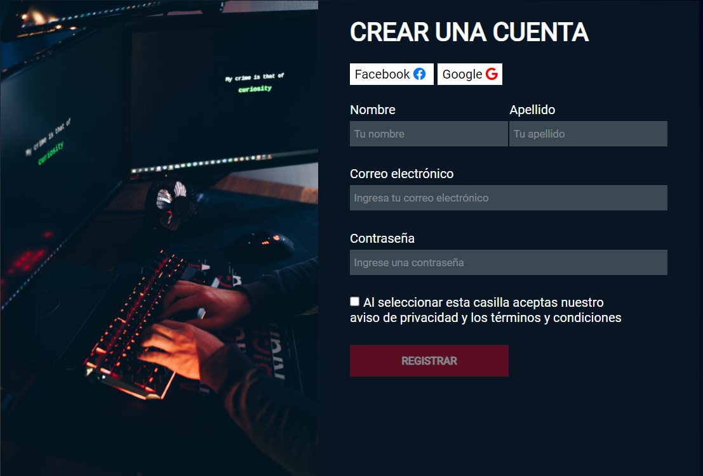

<h1 style="text-align:center">NEW FORM FOR PAGE</h1>
<p>This new form is made with HTML and CSS. Later we will also include the JavaScript language.</p>

<h2>Commands of git</h2>
<p>Use these commands if you hace git installed on your computer.</p>

```
git clone https://github.com/DonVoid18/Form-Pag-DovVoid18.git
```

<a> &#128077;Facebook: DonVoid</a>
<a> &#128276; Youtube: DonVoid</a>